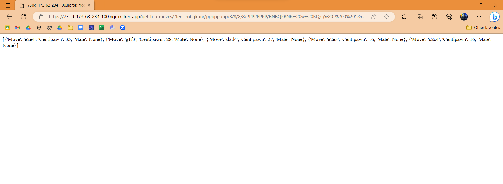
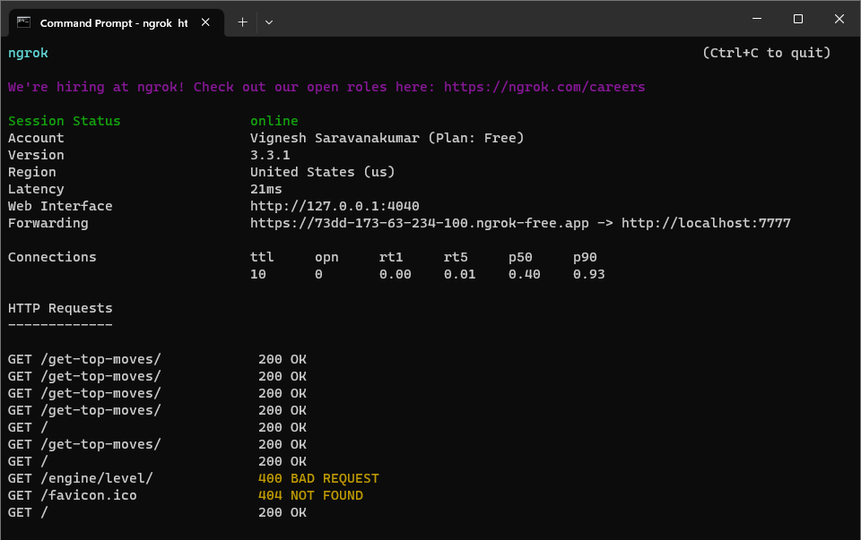
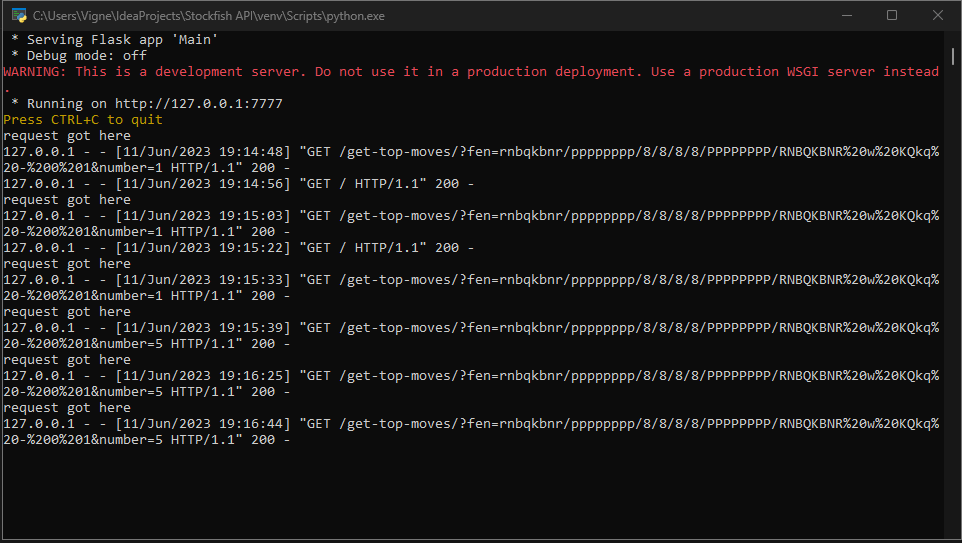
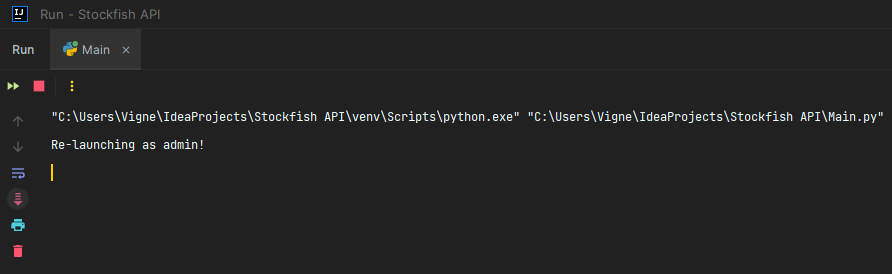

# Stockfish API Wrapper


## Screenshots


## Tech Stack


## Run Locally

Clone the project

```bash
  git clone https://link-to-project
```

Go to the project directory

```bash
  cd my-project
```

Install dependencies

```bash
  npm install
```

Start the server

```bash
  npm run start
```


## API Reference

#### Get all items

```http
  GET /api/items
```

| Parameter | Type     | Description                |
| :-------- | :------- | :------------------------- |
| `api_key` | `string` | **Required**. Your API key |

#### Get item

```http
  GET /api/items/${id}
```

| Parameter | Type     | Description                       |
| :-------- | :------- | :-------------------------------- |
| `id`      | `string` | **Required**. Id of item to fetch |

#### add(num1, num2)

Takes two numbers and returns the sum.


## Acknowledgements
- [Ngrok](https://ngrok.com/)
- [SVG Graphics Explanation](https://developer.mozilla.org/en-US/docs/Web/SVG)
- [Stockfish 3.28.0 Pypi](https://pypi.org/project/stockfish/)
- [Python API Explanation](https://www.youtube.com/watch?v=5ZMpbdK0uqU&t=7s&ab_channel=Indently)
- [Awesome README](https://github.com/matiassingers/awesome-readme)


# Images for later





